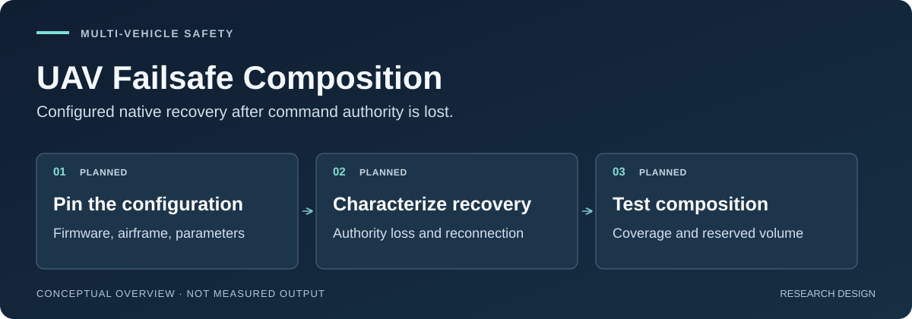

# UAV Failsafe Composition

Configuration-specific recovery behavior for mixed-autopilot fleets after external command authority is lost.

[](https://github.com/500ft/uav-failsafe-composition/actions/workflows/ci.yml)

[](LICENSE)

[Overview](#the-problem) · [Evidence](#evidence-snapshot) · [Quick start](#quick-start) · [First experiment](#first-experiment) · [Reviewer guide](docs/START_HERE.md)



*Proposed study architecture—not a flight trace or safety result. No study result has been generated for this repository. Diagnostic development runs in SIH/SITL exist since 2026-09-20 and are not results; no HITL or flight data exists at all.*

## The problem

A fleet planner cannot assume it still controls a drone after the companion computer or command link fails. The native autopilot takes over, and its response depends on the firmware, airframe, complete parameters, and the precise failure event—not simply the PX4 or ArduPilot name.

This project asks whether those configured recovery behaviors can be characterized well enough to reserve less space than one global worst-case envelope, at matched held-out trajectory coverage.

The intended contribution is a reproducible **conformance study**: which commands stop, when authority changes, what the vehicle does, and what happens after reconnection. Generic safety contracts, cross-stack wrappers, and reconnection handling are not claimed as new. The [targeted source review](docs/day3-source-review.md) explains how prior work narrowed the question.

## Proposed approach

1. **Identify the vehicle.** Archive firmware, airframe, parameter export, simulator, and initial conditions using the [configuration contract](protocols/configuration-manifest.schema.json).
2. **Define the loss event.** Distinguish stopped setpoints from lost heartbeats or companion termination; log surviving streams.
3. **Measure native recovery.** Align authority transitions, modes, latency, motion, and reconnection response.
4. **Evaluate a recovery envelope.** Develop the method on pilot traces, then assess whole-trajectory coverage on separate confirmation data.
5. **Compose only if justified.** Compare individualized reservations with a global envelope before expanding to a fleet allocator.

Coverage of a single vehicle's tube is not, by itself, a fleet-safety guarantee. A global fallback also needs its own validity domain; outside both domains, the method must abstain from a safety claim.

## Evidence snapshot

The executable deliverable today is research-integrity tooling, not a UAV simulator.

| Available artifact | What it establishes | Inspect it |
| --- | --- | --- |
| Configuration schema and negative tests | Required metadata and invalid-input rejection | [Schema](protocols/configuration-manifest.schema.json), [tests](tests/) |
| Source-review rubric and reading records | Which sections were inspected and how they affect the candidate claim | [Rubric](docs/day3-reading-rubric.md), [source review](docs/day3-source-review.md) |
| Reproducible acquisition ledger | Preserved routes, identifiers, access scope, and explicit provenance gaps | [Ledger](evidence/task-day3-2026-09-09/acquisition-ledger.json), [generator](scripts/acquisition_ledger.py) |
| Experiment and claim contracts | Proposed comparisons, uncertainty requirements, and stop conditions | [Experiment 01](docs/experiment-01-authority-loss.md), [claim ledger](docs/claim-ledger.md) |
| Current prior-art review packet (2026-09-15) | Follow-up sources and the day-1 set reconciled against clarified axes; full intake screened; URC-01 decision with a separate gate status (partial) | [Decision](docs/prior-art.md#urc-01-decision--2026-09-15-replacement-plan), [evidence](evidence/task-prior-art-closeout-2026-09-15/README.md) |
| Recorded software checks | Documentation/schema/provenance checks—not research validation | [Verification record](evidence/task-day3-2026-09-09/README.md) |

The 2026-09-09 reconciliation retains **402 raw database rows**, with **90 lacking successful query-log support**. These are acquisition records, not 402 reviewed studies. Recall remains unavailable; the earlier literal-ID overlap is not a valid recall estimate. The later canonical export (2026-09-11) recovers 3 of 6 eligible day-1 sources, which is known-reference coverage, not literature recall; the current review state is in the packet row below. See the [source review](docs/day3-source-review.md) for the correction and remaining competitors to read.

## Quick start

Use **Python 3.11**, matching [CI](.github/workflows/ci.yml), and Git. The only declared dependency is pinned in [requirements.txt](requirements.txt). No autopilot installation, credentials, GPU, or hardware is needed for these checks.

```bash
git clone https://github.com/500ft/uav-failsafe-composition.git
cd uav-failsafe-composition
python3.11 -m venv .venv
source .venv/bin/activate
python -m pip install -r requirements.txt
python scripts/check_repo_contract.py
python scripts/acquisition_ledger.py --check
python -m unittest discover -s tests -v
```

On Windows, activate with `.venv\Scripts\Activate.ps1` in PowerShell instead of `source`.

Expected: the repository contract passes, the committed ledger is consistent, and the test suite ends with `OK`. The ledger check intentionally preserves unresolved provenance; a passing check does not close the literature gate.

To rebuild **only the derived literature ledger** from committed inputs:

```bash
python scripts/acquisition_ledger.py
git diff -- evidence/task-day3-2026-09-09/acquisition-ledger.json
```

This operation is offline. Unchanged inputs should produce no diff. It does not retrieve papers or simulate recovery.

## First experiment

The first study is a **single-vehicle SITL conformance pilot**, not a swarm flight. It compares a source-derived model of the PX4 failsafe framework against the running autopilot on pinned configurations, using bounded initial conditions and explicit failure stimuli. ArduPilot was the original second stack; the programme is PX4-first and a second stack is out of scope while recovery behaviour on the first is unexplained ([2026-09-24 critique](docs/specs/formal-composition/critique-2026-09-24.md)).

Before execution, close the remaining exact-gap/tooling review, verify a common interface, archive complete configured identities, and record a normal-operation trace. The [latest source review](docs/day3-source-review.md) recommends evaluating existing simulator integration before building another launcher.

The [full protocol](docs/experiment-01-authority-loss.md) owns the provisional continuation, pivot, and indeterminate bands. Pilot data may inform the final design; separate confirmation must determine continuation. If individualized envelopes add little value, the conformance benchmark is the deliverable—not a forced fleet expansion.

[First-experiment details](docs/START_HERE.md#first-experiment-decision) · [Gate-driven roadmap](ROADMAP.md) · [Research tasks](docs/TASKS.md)

## Evidence and safety limits

- No study result, HITL measurement, flight test, or validated separation result is included. A SIH/SITL
  apparatus and a small set of diagnostic development runs do exist since 2026-09-20; they are development
  evidence about the apparatus, not findings, and the confirmation campaign is held. See [results](results/README.md).
- No brand-level safety ranking or proven advantage over a global envelope is claimed.
- A valid metadata manifest does not authenticate measurements or prove a safe configuration.
- Flight work requires a site-specific risk assessment, approved containment/geofencing, an independent kill path, a trained safety operator, and responsible-facility approval. RTL starts in simulation.
- Implementation-sensitive public contributions remain subject to the [disclosure boundary](CONTRIBUTING.md#public-disclosure-boundary). Source access is not IP clearance.

## Documentation routes

| If you want to… | Start here |
| --- | --- |
| Understand the project in five minutes | [Reviewer guide](docs/START_HERE.md) |
| Challenge the proposed contribution | [Current source review](docs/day3-source-review.md), then [prior-art boundary](docs/prior-art.md) |
| Inspect the study design | [Research plan](docs/research-plan.md) and [Experiment 01](docs/experiment-01-authority-loss.md) |
| Trace a claim to its evidence | [Claim ledger](docs/claim-ledger.md) and [review index](docs/REVIEW_READY.md) |
| Understand dependencies and alternatives | [Dependency audit](docs/research-dependency-audit.md) and [decision log](docs/decision-log.md) |

## Contributing and license

Reproduction reports, precise source corrections, and protocol critiques are welcome. Include the commit, command or source locator, expected behavior, and observed result. Read [CONTRIBUTING.md](CONTRIBUTING.md) before opening a [pull request or issue](https://github.com/500ft/uav-failsafe-composition/issues).

Repository software is [MIT licensed](LICENSE); third-party publications retain their original licenses. This is a research repository, not an operational flight-safety product.

[Repository identity and presentation references](docs/REPOSITORY_IDENTITY.md)
