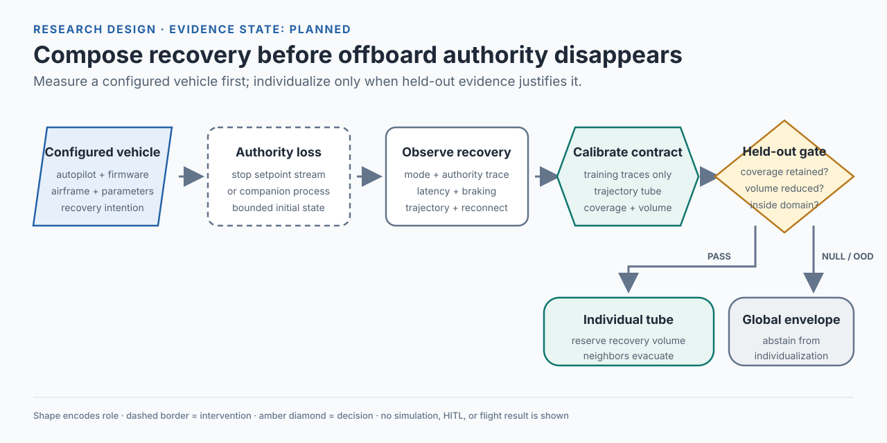

# Start here — UAV Failsafe Composition

[Project overview](../README.md) · [Run the checks](../README.md#quick-start) · [Review index](REVIEW_READY.md)

## In one minute

When a fleet loses command authority over one vehicle, that vehicle follows its configured native recovery behavior. This project proposes measuring those behaviors before asking whether their reserved trajectories can be made mutually compatible.

The research unit is **autopilot + firmware + airframe + complete parameter configuration**. The first experiment is a single-vehicle simulator comparison; fleet composition is a later, conditional study.

The implementation validates research metadata and source provenance, and since 2026-09-20 it also builds and flies a pinned PX4 in SIH/SITL and captures the run. It does not construct a measured recovery tube or establish a safety guarantee. The runs so far are diagnostic development runs, not results: no configured failsafe action has yet been observed, which is the open problem, and the confirmation campaign is held.

## What to inspect first

0. Current review (2026-09-15): the [URC-01 decision](prior-art.md#urc-01-decision--2026-09-15-replacement-plan) and its [evidence packet](../evidence/task-prior-art-closeout-2026-09-15/README.md). Gate status is *partial*: 17 intake rows are unread. Items below are earlier, dated layers.
1. Read the [2026-09-09 source-review decision](day3-source-review.md). It narrows the candidate contribution and supersedes optimistic interpretations of the earlier database overlap.
2. Inspect [Experiment 01](experiment-01-authority-loss.md) for factors, split rules, endpoints, and continuation conditions.
3. Run the [README quick start](../README.md#quick-start). These are offline checks after dependency installation; no simulator or flight operation is triggered.
4. Follow the [claim ledger](claim-ledger.md) to distinguish literature, plans, future simulation, and future measurements.

## Evidence map

| Layer | Committed source | Interpretation |
| --- | --- | --- |
| Research rationale | [Research plan](research-plan.md), [prior art](prior-art.md) | Hypotheses and literature boundary; novelty remains unresolved (URC-01 gate *partial*, [decision](prior-art.md#urc-01-decision--2026-09-15-replacement-plan)) |
| Source acquisition | [Historical export](../evidence/task-2026-09-09/database-export.json) | Raw reported routes; gaps remain visible |
| Targeted reading | [Rubric](day3-reading-rubric.md), [reading records](day3-reading-records.json) | Identified access scope and per-source findings; not a complete systematic review |
| Derived provenance | [Acquisition ledger](../evidence/task-day3-2026-09-09/acquisition-ledger.json) | Deterministically reconciled identifiers and routes, not repaired history |
| Future run identity | [Configuration schema](../protocols/configuration-manifest.schema.json), [example](../protocols/example-configuration-manifest.json) | The example is explicitly `planned-example`, not an executed run |
| Executable checks | [Scripts](../scripts/), [tests](../tests/), [CI](../.github/workflows/ci.yml) | Schema, documentation, and acquisition-integrity checks |
| Verification record | [Day-3 evidence](../evidence/task-day3-2026-09-09/README.md) | Commands, baseline, limitations, and software outputs |
| Study outputs | [Data contract](../data/README.md), [results notice](../results/README.md) | No study result is available; diagnostic development runs exist outside git and are re-derivable from their raw captures |

The acquisition ledger preserves all 402 raw day-2 records and the 12 day-1 source entries. Ninety raw rows lack successful query-log support. Normalized identifiers are not a count of distinct studies, and unread records do not become reviewed through deduplication. Recall is deliberately null.

## First-experiment decision

This table is a reading aid; the [protocol](experiment-01-authority-loss.md) and [research plan](research-plan.md) are authoritative. All numerical gates below are **provisional design decisions**, not findings or a completed preregistration.

| Decision element | Planned contract |
| --- | --- |
| Hypothesis | At least one equivalent recovery intention yields a configuration-specific transition or envelope difference beyond run-to-run variation |
| Setup | Matched simulated vehicle, pinned stack identities, archived parameters, Hold/Land/RTL intentions, bounded initial states |
| Measure | Authority-loss stimulus, mode sequence, latency, motion, terminal outcome, and reconnection acceptance |
| Control | Airframe/environment, logging, command history, and recorded surviving streams |
| Pilot role | Establish feasibility and calibrate design, sample size, and uncertainty; never count pilot traces as held-out confirmation |
| Continue | Separate confirmation reaches registered coverage and at least 10% integrated-volume reduction; approximately 20% is a strong continuation signal |
| Pivot | Below 5% reduction, functionally equivalent mode traces, or unstable calibration: release the conformance benchmark |
| Indeterminate | 5% to below 10%, or an interval spanning a decision boundary: no fleet expansion; at most one separately registered bounded confirmation |

Positive SITL confirmation can justify explicitly simulated offline composition. HITL remains necessary for hardware-timing claims. Marginal vehicle coverage does not establish joint fleet coverage, collision avoidance, or safety outside the registered domain.

## Why the framing changed

The [current reading record](day3-source-review.md) found relevant precedents for trajectory profiling, shared simulator integrations, and explicit reconnection handling. The remaining candidate question concerns configured recovery conformance under equivalent intentions, with a clearly defined loss stimulus and held-out whole-trajectory coverage. As of 2026-09-15 the follow-up sources are read and 17 intake rows remain unread (C-ids in the [reconciled table](reference-coverage-2026-09-12.md#2026-09-15-reconciled--current-axis-table-under-the-replacement-plan-urc-r03)).

Proposed common MAVLink intentions are a design choice, not an installed or verified harness. Firmware versions and interface behavior must be recorded from actual runs before comparing stacks. Remaining full-text and tooling questions stay open.

## Decision diagram

*Existing conceptual decision diagram, retained for its explicit alternative branches. It is neither a trace nor evidence of a safe recovery envelope.*

See the [directed dependency audit](research-dependency-audit.md) for source-linked dependencies and limitations of the graph analysis.

## Where the next work lives

- [Gate-driven roadmap](../ROADMAP.md): overall sequence, not a promise of completed experiments.
- [Research task definitions](TASKS.md): exact-gap closeout and configured-vehicle prerequisites.
- [Sprint task ledger](SPRINT_TASKS.csv): authoritative status of the bounded sprint work; this guide does not duplicate task status.
- [Decision log](decision-log.md): rejected directions and the reason for each change.
- [Contributing rules](../CONTRIBUTING.md): evidence language, source requirements, and public-disclosure boundary.

Before physical testing, obtain the required site-specific approval and safety controls. Neither passing CI nor a complete planning document authorizes a flight.

[Back to overview](../README.md) · [Repository identity and presentation references](REPOSITORY_IDENTITY.md)

## September 11 completion correction

Read the [item-by-item correction](ACQUISITION_CORRECTION_2026-09-11.md) before interpreting a prepared protocol, software check, or search export as a completed research gate. It identifies actual deliverables and the remaining measurement, review, or source-reading work separately.
