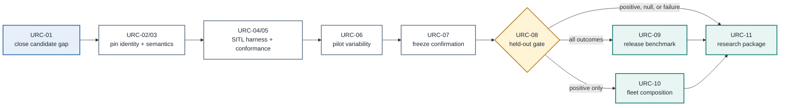

# Research Dependency Audit

> **Evidence state: source-reviewed research design.** This map describes why proposed tasks are
> ordered as they are. It is not a study result and does not establish novelty or safety.

## Audit contract

| Field | Value |
| --- | --- |
| Source baseline | [`a43d9e1`](https://github.com/500ft/UAV-Recovery-Contracts/commit/a43d9e1) |
| Included | [`research-plan.md`](research-plan.md), [`prior-art.md`](prior-art.md), [`experiment-01-authority-loss.md`](experiment-01-authority-loss.md), [`claim-ledger.md`](claim-ledger.md), [`decision-log.md`](decision-log.md), and [`ROADMAP.md`](../ROADMAP.md) |
| Excluded | README navigation, CONTRIBUTING, CI, tests, JSON schemas, visual assets, generated task text, and raw centrality rankings |
| Published graph | Directed; every edge was checked against the included source documents |
| Machine-readable form | [`research-dependency-graph.json`](research-dependency-graph.json) |
| Graphify token usage | **Unavailable**. The host did not expose usage, so it is not recorded as zero. |

Graphify was used to surface candidate relationships. The initial repository-wide navigation
graph was undirected and mixed research documents with CI and schema structure, so its hub
rankings are not treated as scientific or causal findings. Its 50 dangling AST edges came from
JSON-Schema `required` references whose generated `ref_*` targets had no nodes; the semantic
document extraction had no dangling endpoints. The reviewed graph below excludes that AST layer.

In this terminology, a **missing endpoint** is a blank source or target field. A **dangling
endpoint** is a nonblank ID for which no node exists. The committed graph is checked for both.

## Directed dependency map

The decisive relationship is conditional: the single-vehicle held-out gate always supports a
benchmark and report, but it authorizes fleet composition only when individualized contracts
retain coverage and reduce reserved volume under the frozen rule. A null result therefore
completes the floor rather than becoming a renamed fleet-safety success.

## What this audit does not establish

- Novelty remains unresolved until [`URC-01`](TASKS.md#urc-01--close-the-exact-gap-and-tooling-search) completes a dated literature and patent search.
- An edge records a documented prerequisite; it does not prove that the proposed method will work.
- No node represents simulation, HITL, flight, or safety evidence because none exists yet.
- Repository centrality is not used to rank scientific importance.
